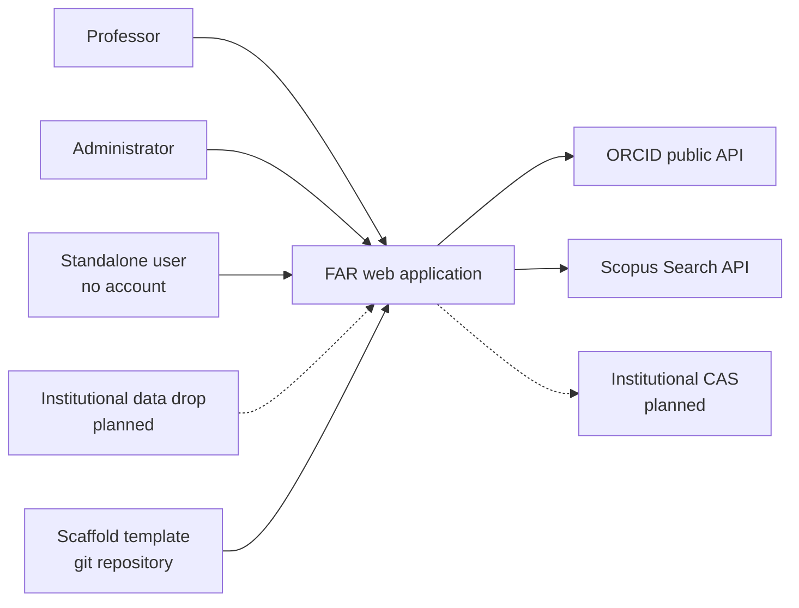
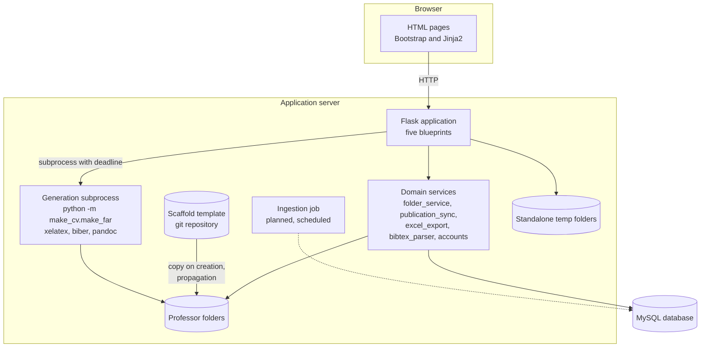
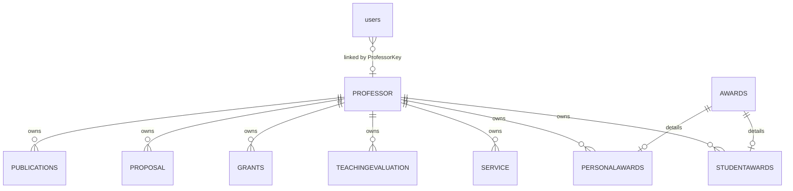
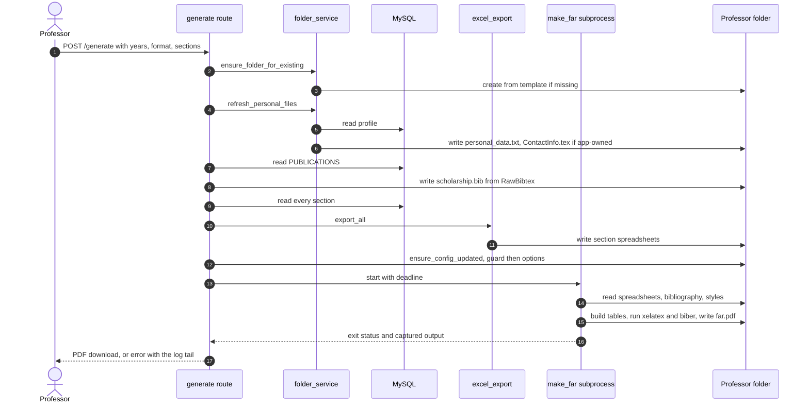
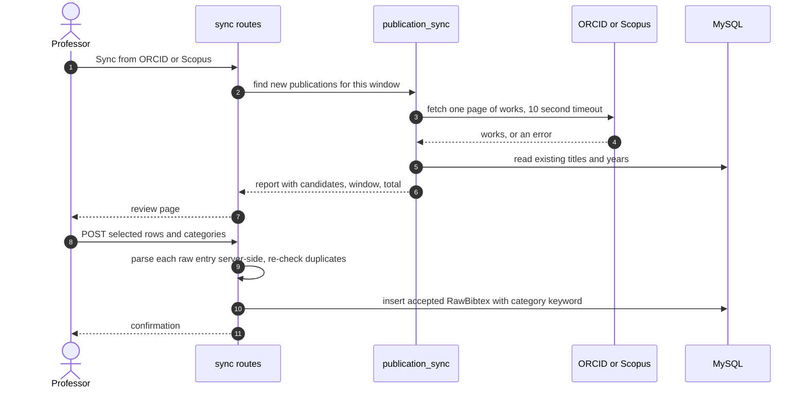
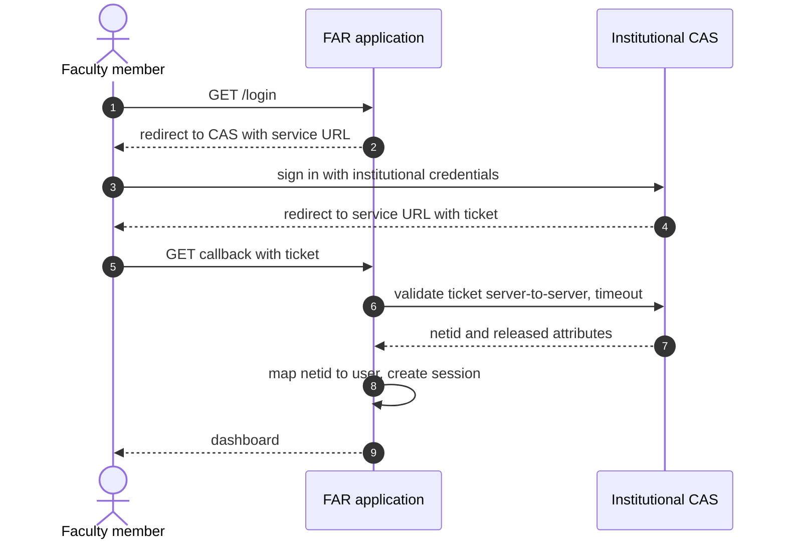
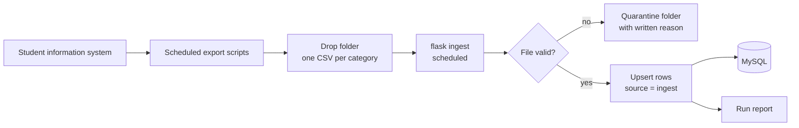
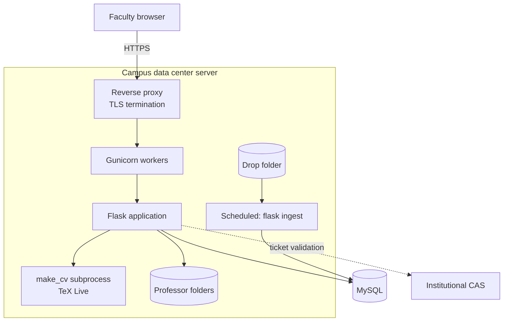

# FAR Web Application — System Design

**Product name (working):** AcadeMetrics
**Version:** 1.0 — 2026-10-02
**Status:** Describes the system as built (through commit 8926410) and the
December 2026 campus deployment target. Planned components are marked
**(planned)** throughout.
**Authors:** Akshay Kumar Thugudam, with Prof. Brian Helenbrook
**Audience:** developers, Clarkson IT (hosting), future maintainers,
and anyone completing a vendor security assessment.

**Publication note.** This document is written to be safe to commit
publicly: it contains no credentials, hostnames, or operational security
detail. Security work that should not be advertised — and the order it
happens in — lives in the private roadmap, not here. Keep it that way
when editing.

---

## Contents

1. Purpose and scope
2. Design principles
3. System context
4. Components
5. Data model
6. Filesystem layout and file ownership
7. Key flows
8. Security design
9. Reliability and failure handling
10. Deployment
11. Testing strategy
12. Scaling and multi-tenancy
13. Architecture decision records
14. Open questions and risks
15. Glossary

---

## 1. Purpose and scope

### 1.1 The problem

University faculty produce an annual Faculty Activity Report (FAR)
documenting teaching, publications, grants, advising, service and
awards. At Clarkson this has been assembled by hand from spreadsheets,
bibliography files and departmental records — typically a day or more
of work per faculty member per year, repeated independently by
everyone.

Prof. Helenbrook's open-source toolchain **make_cv** already turns a
folder of spreadsheets and a BibTeX file into a typeset FAR or CV
through LaTeX. It works well, but it assumes a technical user running
it from a terminal, editing files by hand.

### 1.2 What this system does

The FAR web application puts a browser interface and a database in
front of make_cv:

- Faculty maintain their record once, through web forms.
- Publications synchronise from **ORCID** and **Scopus**, reviewed by
  the professor before anything is added.
- A FAR, CV or Word document is generated on demand.
- Administrators create accounts, generate reports for every professor
  at once, and export data.
- A **standalone mode** lets anyone upload an existing make_cv folder
  and use the interface without an account.

### 1.3 In scope

The web application, its database, the per-professor working folders,
the generation pipeline, and the integrations it calls.

### 1.4 Out of scope

make_cv itself (maintained separately by Prof. Helenbrook), the LaTeX
style files (they belong to the scaffold template), and the
institution's student information system.

---

## 2. Design principles

These are the rules the rest of the design follows. Most were learned
by breaking them. When a proposed change conflicts with one, the change
is wrong or the principle needs revisiting explicitly — never quietly.

### P1. The database is the source of truth

Professor folders are **derived** from the database and are rebuilt on
every generation: the bibliography from `PUBLICATIONS.RawBibtex`, the
spreadsheets from the section tables, the personal data files from
`PROFESSOR`.

**The one exception:** files a human authored by hand — a customised
`ContactInfo.tex`, and (planned) uploaded Education and Employment
files. The app detects these and never overwrites them.

*Why it matters:* every "my data disappeared" bug so far has been a
breach of this rule — most notably a bibliography re-upload that
replaced the publications table and deleted entries added through sync.

### P2. Never silently change an official record

A FAR is an official document. Anything that would add to or change a
professor's record from an outside source — publication sync, CV import
(planned), institutional data ingestion (planned) — goes through a
review step or carries provenance so it can be distinguished and never
overwrites a human's own edits.

### P3. Nothing in a request may wait on something else without a limit

Every external call carries a hard timeout (ORCID and Scopus: 10
seconds). Document generation runs in a separate process with a
deadline (default 300 seconds), and the whole process tree is killed if
it is exceeded. One stuck job costs one request, never a server.

### P4. No server-side process may wait for keyboard input

LaTeX, by default, stops and asks a human what to do when it hits an
error. On a server nobody answers, so it waits forever. Generation must
run non-interactively, and no code path may call `input()`. Code that
does — including parts of make_cv's own command-line tools — is never
run server-side.

### P5. Secrets live in the environment, never in the repository

Database password, session-signing key and API keys come from
environment variables (a `.env` file locally). The repository holds
only non-secret settings and a template documenting which variables
exist.

### P6. Every user-supplied string is escaped before it enters LaTeX

Text a person types ends up inside a LaTeX document. Unescaped, an
ampersand breaks the PDF; worse, a typed LaTeX command could pull
another file into a generated report. All such text passes through
`folder_service._latex_escape`, which neutralises backslashes and
special characters.

### P7. One owner per file

Every file in a professor folder has exactly one owner: the template,
the application, make_cv, or a human. Section 6 lists them. Two writers
for one file is a bug waiting for its first collision.

### P8. Professor folders are data, not clones

Folders are copied from the scaffold template **without** its `.git`
directory. Template updates reach folders through the application
(propagation), not through `git pull` — because the application must
write files the template also tracks.

---

## 3. System context

### 3.1 Actors

| Actor | How they use the system |
|---|---|
| **Professor** | Maintains their record, syncs publications, generates their FAR and CV |
| **Administrator** | Creates professors, generates reports for everyone, exports data, resets passwords |
| **Standalone user** | Uploads an existing make_cv folder and uses the interface without an account |
| **Institutional IT** (planned) | Supplies scheduled data exports; hosts and maintains the server |

### 3.2 External systems

| System | Direction | Purpose | Status |
|---|---|---|---|
| ORCID public API | outbound | Publication discovery | Built |
| Scopus Search API | outbound | Publication discovery (API key required) | Built |
| make_cv (Python package) | local | Table generation and typesetting | Built |
| TeX Live (xelatex, biber) | local | PDF production | Built |
| pandoc | local | Word output | Built |
| Scaffold template (git repository) | local | Source of new professor folders and style files | Built |
| Institutional single sign-on (CAS) | outbound | Authentication | **Planned** |
| Institutional data drop folder | inbound | Scheduled CSV exports from the student information system | **Planned** |



---

## 4. Components



### 4.1 Web application (Flask)

Five blueprints, registered in `app/__init__.py`:

| Blueprint | Prefix | Routes | Responsibility |
|---|---|---|---|
| `auth` | `/` | 5 | Landing page, login, logout, registration, change password |
| `professor` | `/professor` | 57 | Profile and every data section: publications, grants, proposals, awards, teaching, service, advising, theses, reviews, sync |
| `admin` | `/admin` | 6 | Dashboard, professor detail, create professor, create folder, export, reset password |
| `generate` | — | 3 | `/generate`, `/admin/generate-all` (batch), `/admin/download-all-fars` |
| `standalone` | `/standalone` | 12 | Upload a folder, edit its sections, generate — no account, no database |

Authentication uses Flask-Login. The `users` table carries a role, and
decorators restrict professor and administrator routes. Every form uses
Flask-WTF, which enforces CSRF tokens.

### 4.2 Domain services

| Module | Responsibility |
|---|---|
| `folder_service.py` | Creates professor folders from the template, heals missing ones, writes personal data files, owns the "is this file ours to write?" rule, LaTeX escaping, scaffold version stamping |
| `publication_sync.py` | ORCID and Scopus discovery, deduplication against the database, honest reporting of what was checked |
| `excel_export.py` | Writes each section's spreadsheet in the format make_cv reads |
| `bibtex_parser.py` | Parses BibTeX into display fields |
| `accounts.py` | Account creation and passwords |
| `utils.py` | Database access (`execute_query`), configuration loading |
| `standalone_excel.py` | Reads and writes spreadsheets directly for standalone mode |

### 4.3 Generation engine

make_cv is invoked **as a separate process**, never imported into the
web process:

```
python -u -m make_cv.make_far [-p]      # cwd = the professor's FAR folder
```

- `-u` disables output buffering so progress streams in order and is
  not lost if the process hangs.
- The process starts in its own session (process group), so a timeout
  kills LaTeX and biber too — not just the Python parent.
- Output is relayed to the server log line by line **and** captured, so
  a failure's real error text reaches the user.
- Deadline: `GENERATION_TIMEOUT`, default 300 seconds.
- `-p` produces Word output through pandoc.

The same mechanism runs `make_cv.make_cv` for CVs.

### 4.4 Database

MySQL, accessed with PyMySQL through `utils.execute_query`. Nineteen
tables (section 5). A separate test database is used by the test suite.

### 4.5 Professor folders

One working folder per professor on the server's filesystem, named by
`ProfessorKey` (section 6). The folder name is produced in exactly one
place — `folder_service.folder_name_for` — so a naming change touches
one function.

### 4.6 Scaffold template

A clone of the make_cv template repository, maintained by Prof.
Helenbrook. New professor folders are copied from it; propagation
(planned) copies updated style files from it. Its git history is the
backup of every previous style version.

### 4.7 Standalone mode

A deliberately separate path. A user uploads a zipped make_cv folder;
it is extracted into a temporary directory recorded in their session;
all reading and writing happens directly on that folder's spreadsheets.
**Standalone mode never touches the database.**

### 4.8 Planned components

| Component | Purpose |
|---|---|
| CAS login | Institutional single sign-on replaces stored passwords |
| Ingestion job | Scheduled command that loads institutional CSV exports |
| Propagation | Admin page that updates professor folders' style files |
| Feedback channel | Sidebar form for bugs, questions and feature ideas |
| Education and Employment forms | Structured entry for two CV sections |
| CV import | Language-model extraction of an uploaded CV, reviewed before saving |

---

## 5. Data model

### 5.1 Tables

The application references nineteen tables, grouped by domain. Every
professor-owned row is keyed to `PROFESSOR.ProfessorKey`.

| Domain | Tables |
|---|---|
| Identity | `users`, `PROFESSOR` |
| Scholarship | `PUBLICATIONS` |
| Funding | `PROPOSAL`, `GRANTS`, `EXPENDITURE` |
| Recognition | `AWARDS`, `PERSONALAWARDS`, `STUDENTAWARDS` |
| Teaching | `TEACHINGEVALUATION` |
| Advising | `ADVISINGEVALUATION`, `CURRENTSTUDENTS`, `ADVISEECOUNT`, `THESIS`, `UNDERGRADUATERESEARCH`, `PROSPECTIVEVISIT` |
| Service | `SERVICE`, `REVIEWS`, `PROFESSIONALDEVELOPMENT` |



The diagram shows representative relationships; every section table in
5.1 follows the same `ProfessorKey` ownership pattern.

### 5.2 Notable design points

**`users` and `PROFESSOR` are separate.** A user account carries a
`Role` and, for professors, a `ProfessorKey`. Administrators have no
professor record. This separation is what allows the planned CAS login
to replace authentication without touching professor data.

**`PUBLICATIONS.RawBibtex` is canonical.** Display fields (title, year,
DOI) are parsed from the raw entry. The bibliography file make_cv reads
is rebuilt from this column on every generation (P1). Synced entries
carry their category as a `keywords` field inside the raw entry,
because make_cv classifies by keyword and would otherwise guess.

**Awards use a parent–child pair.** `AWARDS` holds what an award *is*
(title, type, year); `PERSONALAWARDS` and `STUDENTAWARDS` hold who it
belongs to and details such as amount. The child carries ownership.

### 5.3 Known gaps

| Gap | Effect | Planned fix |
|---|---|---|
| `STUDENTAWARDS.ProfessorKey` has no foreign key; `PERSONALAWARDS` cascades | Deleting a professor orphans their student awards | Add the FK with cascade |
| No `EmployeeID` on `PROFESSOR` | Institutional data cannot be matched to a professor reliably | Add as the join key for ingestion and possibly CAS |
| No provenance on section rows | Ingested and hand-entered rows are indistinguishable | Add `source` (`manual` / `ingest`) before ingestion ships |

### 5.4 Planned tables

| Table | Purpose |
|---|---|
| `EDUCATION` | Degree, field, institution, years, thesis title, sort order |
| `EMPLOYMENT` | Organisation, location, title, description, years (open-ended allowed), sort order |
| `FEEDBACK` | Type, message, page, user, timestamp, app version, status |

All new professor-owned tables use `ProfessorKey` with `ON DELETE
CASCADE`.

---

## 6. Filesystem layout and file ownership

### 6.1 Layout

```
<professors_root>/
└── <ProfessorKey>/                       one folder per professor
    ├── .scaffold_version                 template commit this folder came from
    ├── Awards/
    │   ├── personal awards data.xlsx
    │   └── student awards data.xlsx
    ├── Proposals & Grants/
    │   ├── proposals & grants.xlsx
    │   ├── grants.xlsx
    │   └── expenditures.xlsx
    ├── Scholarship/
    │   ├── scholarship.bib
    │   ├── current student data.xlsx
    │   └── thesis data.xlsx
    ├── Service/
    │   ├── service data.xlsx
    │   ├── reviews data.xlsx
    │   ├── professional development data.xlsx
    │   ├── undergraduate research data.xlsx
    │   ├── advisee counts.xlsx
    │   └── prospective visit data.xlsx
    ├── Teaching/
    │   └── teaching evaluation data.xlsx
    └── make_cv/
        ├── LaTeXStyles/                  shared style files
        ├── PersonalData/
        │   ├── ContactInfo.tex
        │   ├── personal_data.txt
        │   ├── Education.tex
        │   ├── Employment.tex
        │   └── photo.jpg
        ├── FAR/
        │   ├── make_cv.cfg
        │   ├── far.tex
        │   └── far.pdf, far.log, Tables_far/   (generated)
        └── CV/
            ├── make_cv.cfg
            ├── cv.tex
            └── cv.pdf, Tables/                  (generated)
```

make_cv locates the data directories through `data_dir` in each
`make_cv.cfg`, which points two levels up — to the professor folder
root.

### 6.2 Ownership

| Path | Owner | Written when | Overwritten? |
|---|---|---|---|
| `make_cv/LaTeXStyles/` | Template | Folder creation; propagation (planned) | Only by propagation |
| `make_cv/FAR/make_cv.cfg` | Application | Every generation (guard plus options) | Yes |
| `make_cv/CV/make_cv.cfg` | Application | Every CV generation | Yes |
| `PersonalData/personal_data.txt` | Application | Every generation | Yes |
| `PersonalData/ContactInfo.tex` | Application **unless** hand-edited | Every generation, if missing, pristine, or app-marked | Never if a human edited it |
| `PersonalData/Education.tex`, `Employment.tex` | Template today; human (upload) or application (forms) — planned | Per the professor's chosen source | Only in form mode |
| `Scholarship/scholarship.bib` | Application | Every generation, from `PUBLICATIONS` | Yes |
| All section spreadsheets | Application | Every generation, from the database | Yes |
| `FAR/Tables_far/`, `far.pdf`, logs | make_cv | Every generation | Yes |
| `.scaffold_version` | Application | Creation; re-stamped by propagation | Yes |
| `.git` | — | Never present | — |

The "is this file ours to write?" test lives in `folder_service` and
treats a file as application-owned if it is **missing**, **byte-identical
to the template**, or **carries the application's marker comment**.
Anything else was authored by a person and is left alone.

---

## 7. Key flows

### 7.1 Generate a FAR

The core flow. Every step after the request is idempotent: running it
twice produces the same folder state.



**The configuration guard** (step 13). make_cv's own config repair fills
missing keys from CV defaults, one of which (`References = false`)
refers to a section the FAR style does not define and makes LaTeX fail.
After any repair the application forces FAR-safe values: `references =
true`, `latexfile = far.tex`. CV configurations are left alone.

### 7.2 Batch generation

`/admin/generate-all` runs the flow in 7.1 for every professor in turn.

- The folder is healed first; a professor whose folder cannot be
  created gets a failure row, not a crash.
- **Exactly one result row per professor**, whatever happened —
  success, generation failure, missing output, or preparation error.
- One professor's failure never stops the batch.

Batch generation currently runs **inside the HTTP request**. That is
acceptable at a handful of professors and not at hundreds (section 12).

### 7.3 Publication sync (ORCID and Scopus)



Design points:

- **Honest reporting.** Every run states which window it checked
  ("works 1–60 of 97"). A failed fetch is shown as a failure and never
  as "up to date".
- **Pagination by offset**, so large records are checked in windows
  and the professor resumes where the last one stopped.
- **Raw-only form contract.** The browser submits only the raw entry,
  the chosen category, and which rows to import. Title, year and DOI
  are derived on the server by parsing the raw entry, so the browser
  can never contradict the record.
- **Duplicates are rechecked at insert time**, not just at review time.
- **Scopus fetches before reading the database**, so a rejected key or
  a timeout ends the request with nothing touched.
- **Deduplication key** mirrors make_cv's own title identifier, with
  LaTeX decoded first, so `$\omega$` and `ω` match.

### 7.4 Folder creation and self-healing

1. An administrator creates a professor.
2. The template is copied into a new folder named by `ProfessorKey`,
   excluding `.git`.
3. Personal data files are written from the database.
4. The folder is stamped with the template's current commit.

If a folder is later missing — deleted, or never created — the next
generation recreates it. Nothing is lost, because the folder was always
derived from the database (P1).

### 7.5 Standalone mode

1. The user uploads a zipped make_cv folder.
2. It is extracted into a temporary directory, recorded in the session.
3. Sections are read and edited directly in that folder's spreadsheets.
4. Generation runs against the folder.
5. A reset clears the session's folder.

### 7.6 CAS login (planned)



- The netid is taken **only** from the validation response, never from
  the query string.
- If `CAS_SERVER_URL` is not set, password login remains — for local
  development and the test suite.
- Logout also ends the CAS session.

### 7.7 Institutional data ingestion (planned)



- **File-based, never a direct connection** to the institution's
  systems. Any institution that can produce CSVs matching the published
  templates can be supported, whatever system they run.
- `employee_id` is the key in every template.
- Idempotent: loading the same file twice changes nothing.
- Ingested rows carry `source = ingest`. Ingestion updates its own rows
  and **never overwrites a row a professor entered or edited** (P2).
- A malformed file is never half-loaded.

### 7.8 Propagation (planned)

1. The administrator page compares each folder's `.scaffold_version`
   with the template's current commit: up to date, behind, or unknown.
2. For folders that are behind: delete `make_cv/LaTeXStyles/`, copy it
   fresh from the template, re-stamp.
3. Nothing else is touched — not configuration, personal data, the
   bibliography, spreadsheets or generated output.
4. One result row per folder; one failure never stops the rest.

The page also compares the template's version tag with the installed
make_cv version and warns on mismatch.

---

## 8. Security design

### 8.1 Trust boundaries

| Boundary | What crosses it | Controls |
|---|---|---|
| Browser → application | Form data, uploads, session cookie | CSRF tokens, signed sessions, role checks, server-side derivation of sync fields |
| Application → database | Queries | Parameterised queries; credentials from the environment |
| Application → generation process | Text inside LaTeX files | Escaping of user text (P6); separate process; deadline |
| Application → external APIs | Outbound requests | Timeouts; keys from the environment; failures reported, never retried silently |
| Drop folder → application (planned) | Institutional CSV files | Validation, quarantine, provenance |
| Upload → standalone temp folder | User-supplied archive | Extraction confined to a per-session temporary directory |

### 8.2 Authentication and authorisation

- **Today:** email and password; passwords stored as salted hashes
  (Werkzeug); sessions via Flask-Login; role-based access to professor
  and administrator routes; professors may change their own password;
  administrators may reset one.
- **Planned:** institutional CAS replaces stored passwords for campus
  users. The application then stores no faculty credentials at all.
- **Ownership checks:** professor routes act on the logged-in user's
  own `ProfessorKey`. Sync import ignores any professor key a submitted
  form might contain.

### 8.3 Secrets

| Secret | Variable |
|---|---|
| Database password | `FAR_DB_PASSWORD` |
| Session-signing key | `SECRET_KEY` |
| Scopus API key | `FAR_SCOPUS_API_KEY` |

The application logs a warning at startup if it is running on the
development default session key.

### 8.4 Input handling

- **CSRF:** every form carries a token. The test suite disables CSRF,
  so each new form also gets one manual browser submission before
  release.
- **LaTeX:** user text is escaped before it enters a document (P6).
- **Sync:** the server derives fields from raw entries rather than
  trusting submitted ones.
- **Archives:** standalone uploads are extracted into an isolated
  temporary directory.

### 8.5 Data sensitivity

Following Clarkson IT's assessment:

- Most of the data is **public** — publications, grants, awards,
  service.
- **Teaching evaluations are sensitive** but are not legally protected
  personal information.
- The system holds **no** government ID numbers, financial account data
  or student academic records beyond names and thesis titles.

This places the system in a lower breach-notification category than
student or financial systems — but evaluation data still needs access
control and should not leave the institution without agreement.

### 8.6 Compliance targets (commercial)

| Requirement | Purpose | Status |
|---|---|---|
| WCAG 2.1 AA | Accessibility; Clarkson's legal standard | Planned audit and fixes |
| VPAT | Accessibility conformance report for buyers | After the audit |
| HECVAT | Higher-education vendor security questionnaire | Planned |
| GDPR | Only if serving EU institutions | Not applicable yet |
| ISO 27001 / NIST 800-171 | Third-party security certification | Long term |

---

## 9. Reliability and failure handling

| Failure | Detection | Behaviour | Recovery |
|---|---|---|---|
| LaTeX error | Non-zero exit | Captured output shown to the user | Fix the data; regenerate |
| LaTeX or biber hang | Deadline reached | Whole process group killed; timeout reported with the last output | Investigate; regenerate |
| make_cv config missing keys | Verification fails | Repaired, then FAR guard applied | Automatic |
| Professor folder missing | Path check | Recreated from the template | Automatic |
| One professor fails in a batch | Per-professor try block | Failure row; batch continues | Retry that professor |
| ORCID or Scopus slow or down | Timeout or error | Honest error card; nothing written | Retry later |
| Scopus key rejected | 401 / 403 | Message explains the key's network restriction | Use from campus, or institutional key |
| Database unreachable | Connection error | Request fails with an error | Wait for the database |
| Bad ingestion file (planned) | Validation | Quarantined with a reason; nothing loaded | Correct and re-drop |
| CAS unreachable (planned) | Validation timeout | Login refused with a clear message | Wait; administrator fallback per policy |

**Note on one historic incident.** Two batch freezes occurred before the
generation deadline existed. One was traced to LaTeX waiting for
keyboard input; the other's cause was never established. The deadline
now contains either, whatever the cause.

---

## 10. Deployment

### 10.1 Current

Developer machines run the application with the Flask development
server, against a shared Clarkson-hosted MySQL database, with professor
folders on the local disk. The application has run on two machines.

### 10.2 December 2026 target — campus data center



**Responsibilities**

| Clarkson IT | Application team |
|---|---|
| Server provisioning | Application code and releases |
| Operating system patching | Database schema and migrations |
| Backups | Generation pipeline |
| Infrastructure support | Application support and bug fixes |

**Server requirements**

- Python 3.12
- TeX Live with `xelatex` and `biber`; `pandoc` for Word output
- make_cv **pinned** for deployment (the development requirements file
  is intentionally unpinned)
- Gunicorn behind a reverse proxy with TLS
- Registration as a CAS service
- Read access to the institutional drop folder
- Environment variables per 8.3, set on the server

**Gunicorn sizing:** two to four synchronous workers. Generation runs
in a separate process with a deadline, so a long generation occupies
one worker for at most the deadline.

### 10.3 Commercial target

Universities expect hosted software rather than something to install.
The commercial product runs on a public cloud (AWS or Google Cloud),
containerised, with a managed database — see section 12 for how
institutions are separated.

---

## 11. Testing strategy

### 11.1 The suite

224 tests (222 passing, 2 skipped) across 25 files.

**Practices**

- **Red first.** A new behaviour gets a failing test before the code,
  and the expected failure is predicted, so a test that passes for the
  wrong reason is noticed.
- **Hermetic fakes for everything external.** HTTP calls to ORCID and
  Scopus are faked. Generation tests substitute tiny scripts for
  make_cv — including one that spawns a child process, to prove the
  timeout kills the whole tree.
- **A scaffold fixture** builds a miniature template in a temporary
  directory. It deliberately contains things the code must ignore — a
  `.git` directory, configs with unsafe values — so exclusion is
  actually tested.
- **Database tests** run against a separate test database and clean up
  after themselves.

### 11.2 Known blind spots

| Not covered by the suite | Covered instead by |
|---|---|
| CSRF (disabled in tests) | One browser submission per new form |
| JavaScript behaviour | Manual browser check |
| PDF appearance | Manual review of generated output |
| Real ORCID and Scopus responses | Manual live run, recorded |
| Real make_cv and LaTeX | Live generation before release |

These are tracked in `tests/MANUAL_CHECKS.md`. Automating the full
generation path in continuous integration — with TeX in the build image
and curated fixtures — would retire most of them.

---

## 12. Scaling and multi-tenancy

### 12.1 Generation is the bottleneck

A single FAR takes roughly 10–20 seconds. Batch generation runs
professors one after another inside a single web request:

| Faculty | Approximate batch time |
|---|---|
| 2 | under a minute |
| 30 | 5–10 minutes |
| 300 | 50–100 minutes |

A web request cannot reasonably run for an hour. **Batch generation
must become a background job** — queued, run by a worker, with progress
the administrator can watch — before deployment at department scale.

### 12.2 Multi-tenancy — the decision to make before the second customer

How are institutions separated in the commercial product?

| | **A. One deployment per institution** | **B. Shared deployment, tenant column** | **C. Shared application, database per institution** |
|---|---|---|---|
| Data isolation | Complete | Enforced in code on every query | Strong |
| Security questionnaire | Easiest to answer | Hardest | Moderate |
| Per-institution templates | Natural | Needs per-tenant configuration everywhere | Natural |
| Operating cost | Highest — one stack each | Lowest | Moderate |
| Upgrades | Repeated per institution | Once | Once, with per-database migrations |
| Risk of cross-institution leak | None | Highest — one missed filter | Low |

**Leaning A, moving toward C.** The business model is consulting-led,
with per-institution setup; each institution has its own report format
and data feeds; and universities ask about isolation in security
reviews. A single shared database (B) is cheapest to run but makes the
worst possible bug — one institution seeing another's faculty data — a
single missing `WHERE` clause away.

### 12.3 Keeping the options open now

- Institution-specific values (name, address, email domain, department
  list) already live in configuration, not code. Keep it that way.
- `EmployeeID` becomes the stable external key.
- Folder naming is centralised in one function.
- Never hard-code anything Clarkson-specific in templates or queries.

---

## 13. Architecture decision records

**ADR-001 — The database is the source of truth.**
*Context:* make_cv reads files. *Decision:* the database is canonical;
files are rebuilt on every generation. *Consequence:* folders can be
recreated at will; anything written only to a file is lost unless it is
a recognised hand-authored file.

**ADR-002 — Professor folders are data, not git clones.**
*Context:* the template is a git repository, and its documented update
mechanism is `git pull`. *Decision:* copy without `.git`; update through
the application. *Consequence:* the application can safely write
configuration files the template also tracks; folders never show
spurious changes; updates need an application feature (propagation).

**ADR-003 — Generation runs in a subprocess with a deadline.**
*Context:* in-process generation froze the server when LaTeX hung.
*Decision:* separate process, own process group, unbuffered, live relay
plus capture, deadline. *Consequence:* a hang costs one request; failures
carry their real error text.

**ADR-004 — Publication sync is review-gated.**
*Context:* a FAR is an official record. *Decision:* discovered works are
shown for acceptance; nothing is added silently; fields are derived
server-side from raw entries. *Consequence:* slower than automatic
import, but no unreviewed change ever reaches a report.

**ADR-005 — Scopus through its REST API, not make_cv's fetcher.**
*Context:* make_cv's Scopus tool prompts for keyboard input and keeps
its own key store. *Decision:* call the Scopus Search API directly.
*Consequence:* full control of timeouts, errors and key storage.

**ADR-006 — Secrets in the environment.**
*Decision:* environment variables, with the configuration file as a
fallback for non-secret settings only. *Consequence:* the repository
can be public.

**ADR-007 — Propagation copies style files only (planned).**
*Decision:* replace `LaTeXStyles/` wholesale; touch nothing else.
*Consequence:* simple and safe; configuration changes from upstream are
handled by the configuration repair path instead.

**ADR-008 — Institutional data arrives as file drops (planned).**
*Context:* institutions route vendor data through intermediary exports.
*Decision:* scheduled CSV files, published templates, idempotent loads
with provenance. *Consequence:* independent of the institution's
underlying system.

**ADR-009 — CAS login with a configurable fallback (planned).**
*Decision:* CAS when configured; password login otherwise.
*Consequence:* development and tests are unaffected; campus users'
credentials are never stored.

---

## 14. Open questions and risks

| # | Question or risk | Why it matters |
|---|---|---|
| 1 | Multi-tenancy model | Hardest decision to change later (12.2) |
| 2 | Batch generation as a background job | Required before department-scale use (12.1) |
| 3 | TeX Live on the target server | Generation is impossible without it |
| 4 | Which attributes CAS releases | An employee ID would unify login and ingestion keys |
| 5 | How administrators log in under CAS | Not every administrator has an institutional account |
| 6 | Education and Employment: one source per professor | Upload and form paths write the same files |
| 7 | AI data policy for CV import | A CV is personal data sent to an outside service |
| 8 | Institutional folder naming vs `ProfessorKey` folders | The institution's shared drive uses `LastnameFirstname-EmployeeID`; the application uses the key. Ingestion must bridge them |
| 9 | make_cv is GPL v3 | Hosting is not distribution, so source-sharing obligations are not triggered by a hosted service; shipping software to institutions would be. Dual licensing is the author's decision |
| 10 | Unpinned development dependencies | Deployment must pin versions |

---

## 15. Glossary

| Term | Meaning |
|---|---|
| **FAR** | Faculty Activity Report — the annual report this system produces |
| **make_cv** | Prof. Helenbrook's open-source toolchain that turns spreadsheets and BibTeX into typeset reports |
| **Scaffold template** | The folder structure every professor folder is copied from |
| **Professor folder** | A professor's working directory, derived from the database |
| **ProfessorKey** | Internal identifier for a professor |
| **EmployeeID** | The institution's identifier for an employee (planned) |
| **Propagation** | Updating professor folders when the template changes |
| **RawBibtex** | The canonical stored form of a publication |
| **CAS** | Central Authentication Service — institutional single sign-on |
| **SIS** | Student information system (e.g. PeopleSoft, Banner) |
| **ORCID** | Persistent researcher identifier and registry |
| **Scopus** | Elsevier's abstract and citation database |
| **HECVAT** | Higher Education Community Vendor Assessment Toolkit |
| **VPAT** | Voluntary Product Accessibility Template |
| **WCAG** | Web Content Accessibility Guidelines |
| **Provenance** | A record of where a row came from — typed by a person or ingested |
